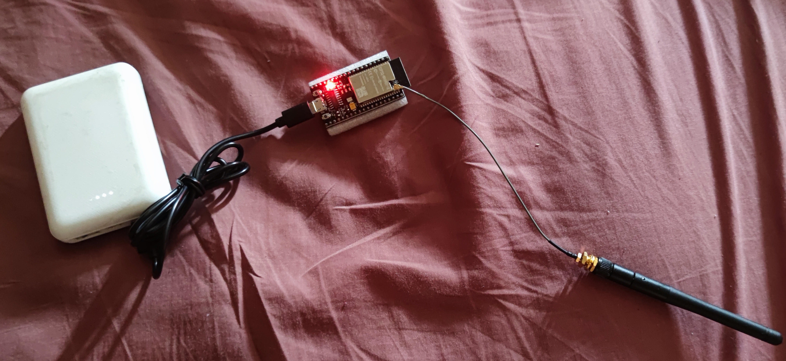

# xtoys_LS_GW
ESP32 Love Spouse XToys MQTT gateway for remote controlling your toys

Are your Love Spouse toys losing connection with XToys App? It is fixable!

ESP32 gateway provides a stronger signal to the toys while keeping a connection with the APP over WiFi.

Requirements: 
- Xtoys.app requires a secured connection to the MQTT broker. Use some publicly available MQTT broker, such as Hivemq, to connect the APP to the secured WebSocket MQTT. Or create your own local MQTT using Mosquitto and Let's Encrypt on some VM or Docker.
- ESP32 - I recommend buying the version with an external antenna option and an additional antenna for better coverage. In my tests, I have used ESP32-WROVER-IE and 5dBi antenna to achieve over 20m coverage even with walls.

In XToys.app Custom Toys create new MQTT Toy and fill parameters:
- Name: \<\<Name of your chosing\>\>
- Type: 2 Channels Vibrator
- NR of intensity steps: 3
- MQTT address: wss://\<\<your MQTT domain\>\>:\<\<MQTT secured websocket port\>\> for ex. wss://services.paxy.in.rs:8083 (MQTT must provide secured WebSocket service with a trusted certificate on the specified port)
- Credentials required: Yes
- MQTT publish topic: xtoys/gw/ (or anything else).
- Message payload: \<\<vibrate\>\>,\<\<channel\>\>

In ESP32 firmware, you can customize the following settings:
- SSID: \<\<WiFi SSID\>\>
- password: \<\<WiFi PSK\>\>
- mqttServer: \<\<MQTT server\>\> - firmware use unencrypted MQTT connection
- mqttPort: 1883 - port for unencrypted MQTT connection
- mqttUser: \<\<MQTT username\>\>
- mqttPassword: \<\<MQTT password\>\>
- xtoys_topic: xtoys/gw/ (or anything else)

The 3D printable box for ESP32-Wrover with external antenna is available on [Thingiverse](https://www.thingiverse.com/thing:6125573).

Special thanks for the help from [denialtek](https://github.com/denialtek) and [AndroSphinx](https://github.com/AndroSphinx) for the protocol and code used in this project.

Ref: https://github.com/buttplugio/docs.buttplug.io/issues/2
